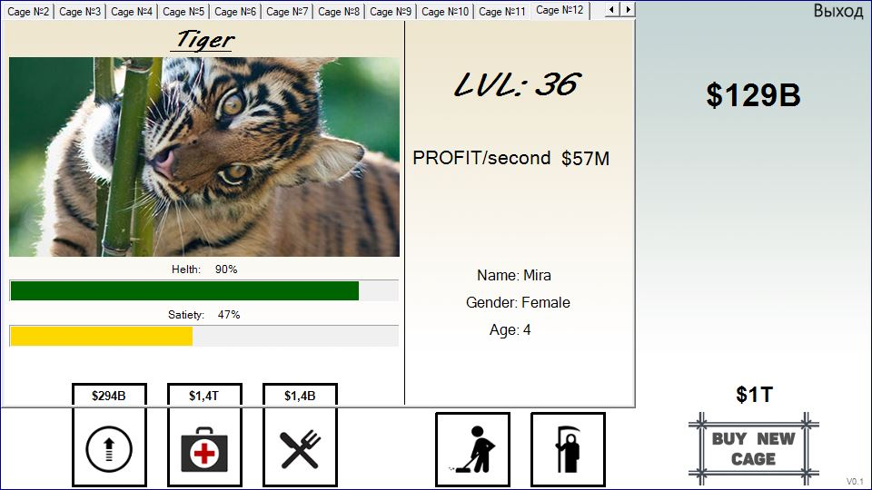
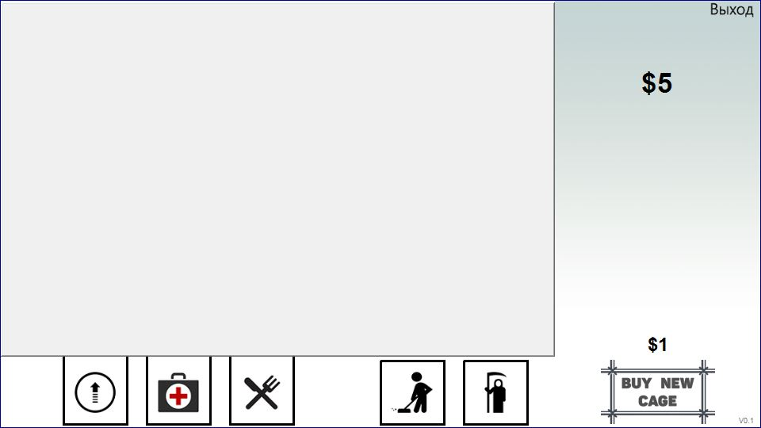
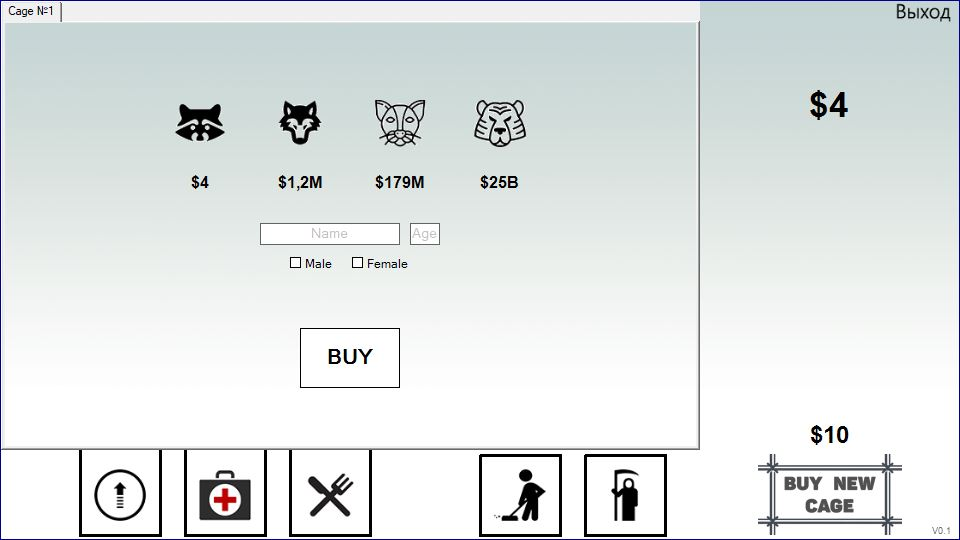
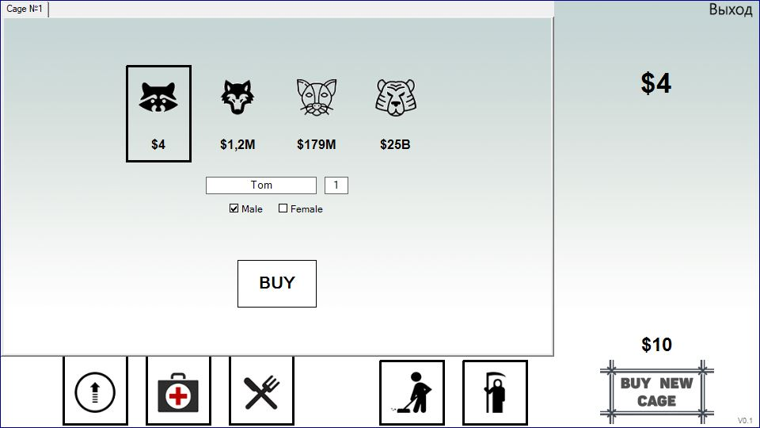
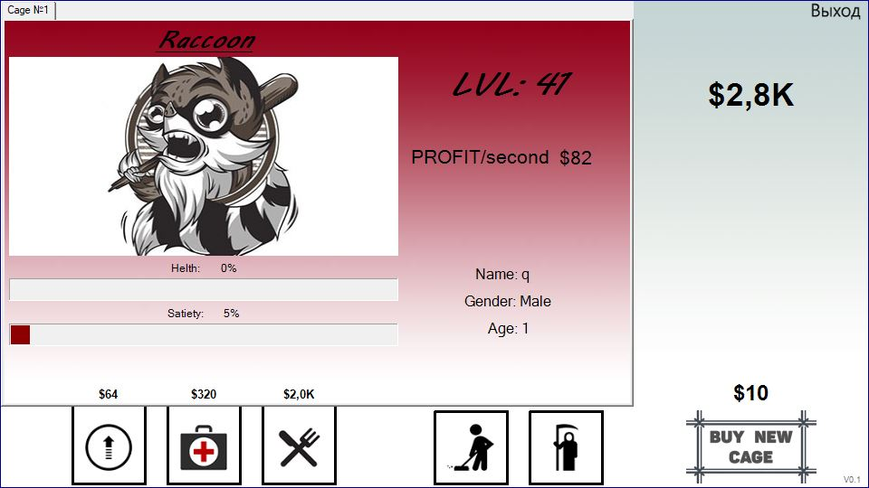

# 👋Добро пожаловать!

*Перед вами игра, в которой нужно покупать приносящих вам доход животных, прокачивать их характеристики и следить, чтобы они не голодали.*

## 📑Оглавление
 - [О проекте](#о-проекте)
 - [Об игре](#об-игре)
 - [Планируемые изменения](#планируемые-изменения)

## ⚙О проекте
Не стоит ждать от игры слишком многого, это был просто мой **учебный** проект, который создавался с целью получения и закрепления на практике новых знаний и навыков в программировании на языке C#.  
Но по мере увеличения количества строк кода эта идея стала мне даже нравиться, и мне захотелось довести программу до ума, а не кинуть в абсолютно сыром состоянии, как большинство других учебных проектов.  
И вот перед вами версия, которую уже не стыдно опубликовать. Буду очень признателен если вы не поленитесь и скачаете ее себе для тестирования. И тем более буду рад любым замечаниям/предложениям/форкам/пул-реквестам.  
:D  

В этом приложении используются: наследование, полиморфизм, делегаты, повышающее приведение типов(upcast), лямбда выражения, индексаторы, события, перечисления, а так же динамическое создание, взаимодействие и удаление элементов формы.

Местами архитектура приложения является избыточно сложной. Некоторые элементы добавлены только из-за того, что хотелось отработать их применение на практике. Например, к таким элементам можно отнести средние в иерархии наследования классы.

**Особенности:**  
 - Были совмещены жанры кликера(на подобии ["AdVenture Capitalist"](https://store.steampowered.com/app/346900/AdVenture_Capitalist/)) и тамагочи. 
 - Выполнено в WinForms.
 
## 🎮Об игре
Запустив приложение, пользователь попадает сразу в основное окно. Здесь находятся все кнопки, а так же количество денег игрока и цена на покупку клетки.

Для начала купим одну клетку, нажав на соответствующую кнопку. Деньги спишутся со счета, а цена на следующую клетку увеличится

Теперь перед нами отображается меню приобретенной клетки, в котором мы можем выбрать животное.

На начальном этапе есть возможность купить только енота, поэтому на него и нажимаем. После этого останется выбрать питомцу имя, указать его возраст и пол. 

Выбор всех характеристик **обязателен**! Без них вы не сможете произвести покупку. После всех этих операций окно будет выглядеть примерно следующим образом:

Остается только нажать кнопку покупки.

Сразу после приобретения сытость питомца начнет стремительно уменьшаться. Когда она достигнет отметки в 10%, то уменьшаться будет еще и здоровье. Если оно опустится до 0, то животное умрет. 

Чтобы этого не допустить, его необходимо своевременно кормить и лечить, нажимая на соответствующие кнопки. Каждое действие требует указанное над кнопкой количество денег и увеличивает запас выбранной характеристики на 20%.

Основная задача в данной игре - это заработок как можно большего количества денег. Но для этого не достаточно просто приобретать питомцев и заботиться о них. Необходимо так же увеличивать их уровень, так как именно это дает максимальный прирост к прибыли. Одновременно с этим увеличиваются максимальные запасы здоровья и сытости.

Для покупки нового уровня необходимо нажать на соответствующую кнопку.  
Со временем это начинает стоить просто огромных денег. На столько огромных, что дающиеся прибавки к характеристикам становятся абсолютно бесполезными на их фоне. Когда наступает такой момент, стоит переключить свое внимание на другие способы заработка. Например, купить еще одного подопечного и разместить его в соседней клетке. Можно одновременно владеть как разными, так и одинаковыми животными. Стоит отметить, что цена на каждое следующее того же типа будет выше с каждым разом.

Но необходимо быть внимательным. Если увлечься каким-то одним животным и забыть про остальных, то они могут умереть от голода. Они перестанут приносить доход, но будут занимать клетки. Все потраченные на них деньги будут безвозвратно утеряны.

Для того чтобы освободить клетки для новых животных, необходимо нажать на кнопку уборки. От живого животного освободить клетку нельзя, но есть возможность убить от животное, нажав на соответствующую кнопку, после чего клетку можно будет очистить. Оба эти действия являются бесплатными.

Сразу после очистки клетки будет отображено меню покупки нового питомца.

## 💭Планируемые изменения 
Примерный порядок нововведений:
 - Доработка README.
 - Доработка баланса.
 - Введение времени, старения и естественной смерти животных. 
 - Сохранение/загрузка игры.
 - Система аккаунтов.
 - Система достижений.
 - Тесты.
 - Новые виды животных(маловероятно и уж точно не скоро).
